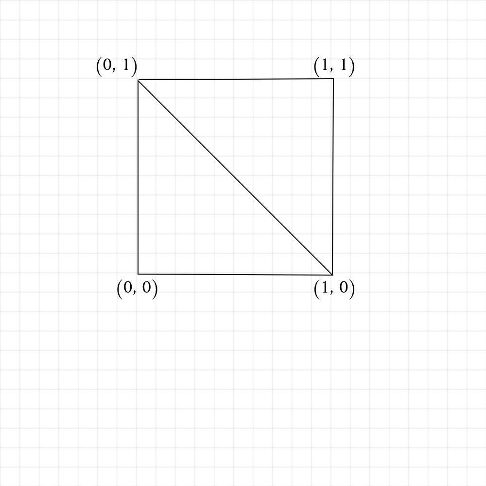

# Assignment 3 (Earthquake) Worksheet

## Q1: Useful math

In this assignment, you will be dealing with earthquake data from the United
States Geological Survey. As with any real-world dataset, the data have
real-world units, which may not always match up with units we want to use for
the data visualization. As such, there are a few handy practices commonly used
when constructing visualizations from real-world data; one of the most common
is normalization.

Normalization is the process of converting a number inside of an
arbitrary range to a floating point number between 0.0
and 1.0, inclusive. For example, if we have a value `v = 1.5` in the list of
numbers `{0.0, 1.5, 2.0, 1.3}`, the normalized value would be `v_normalized =
0.75`.

These two functions, part of the C++ standard library, will be useful for your
first question: 

```
/* 
 *   - `std::min_element()` - return the minimum of a vector
 *   - `std::max_element()` - return the maximum of a vector
 *
 * Example usage:
 *    std::vector<float> quakes = {0.0, 1.5, 2.0, 1.3};
 *    float min_magnitude = std::min_element(quakes.begin(), quakes.end()); 
 */
```

Using the min_element() and max_element() functions, write a routine to normalize
the values in an arbitrary vector (list) and return a new vector:

```
std::vector<float> normalize_list(std::vector<float> quakeList) {
  float max = quakeList.max_element();
  float min = quakeList.min_element();
  float range = max -min;
  std::vector<float> norm;
  for(int i = 0; i < quakeList.size(); i++){
      float denom = quakeList.at(i)-min;
      norm.push_back(denom/range);
  }
  return norm;
}
```

Now, to check that your algorithm works, let's just work out a quick example
by hand.  What would the following code print out if you were to run it?
Note, if your math is correct, all of the values printed should be between 0.0
and 1.0 inclusive.

```
std::vector<float> quakes = {0.0, 2.3, 5.1, 1.1, 7.6, 1.7};
std::vector<float> normalized_quakes = normalize_list(quakes);

for (int i = 0; i < normalized_quakes.size(); i++) {
    std::cout << normalized_quakes[i] << " ";
}
std::cout << std::endl;
```
Output: 
```
/* --- Fill in the expected output here (e.g. "0.0, 0.5, 0.5, 1.0, 0.5, 0.12, 0.6") --- */
0.0 0.302631578 .6710526315 0.1447368421 1 .223684210
```

## Q2: Constructing a mesh

For the first two assignments, we were able to use the QuickShapes class to draw pretty much everything we had to draw because everything could be constructed from 3D graphics primitives like cubes, spheres, cones, etc.  This assignment will be the first one where we create a custom 3D shape made of triangles and apply a custom texture to it.

To create a triangle mesh from scratch, you will need to understand how a **Vertex Array** and an **Index Array** are used together to define each triangle that belongs to the mesh.  We discuss this in detail in lecture, but here is a brief recap:  

The vertex array will hold the actual 3D coordinates for each vertex of the mesh.  Each vertex is a point, so these should be represented as Point3s, and there should be one element in the array for each vertex in the mesh.  Then, the index array tells us how to connect these vertices together to form triangles.  

The index array refers to vertices stored in the vertex array by their index in that array.  So, if the vertex array is of length n, valid indices would be 0, 1, 2, ... n-1.  Since these are all positive integers, the index array is usually stored as an array of unsigned ints.  Even though each entry is a single unsigned int, we want to think of the entries as being grouped into sets of 3.  (Since it takes 3 vertices to define a single triangle, we should always add indices in groups of 3, and the length of the index array should always be 3 times the number of triangles in the mesh).  One final tip to remember is to use counter-clockwise vertex ordering to tell the graphics engine which side of the triangle is the "front" and which side is the "back".  Remember, only the front face will show up; the back will be invisible!  

Let's practice all these concepts with a simple example of a square.  Create your own copy of the image below (using a piece of paper that you photograph or a drawing program) and label each vertex with an index number
(starting at 0).

**Replace this image with your drawing:**



Now, write out the square's vertex array, using the familiar `Point3` class
(since it's in the *xy*-plane, assume z = 0 for all points):

```
std::vector<Point3> squareVertexArray = { 
    Point3(1, 0), Point3(0, 1), Point3(0, 0), Point3(1, 1)
    /* --- Fill in your `Point3`s here */
};
```

Finally, write out the square's index array based on the indices you defined in the picture above. Make sure your indices are defined in counter-clockwise order so that a 3D camera looking down on your square from some +Z height above will see the front faces of your triangles.

```
std::vector<int> squareIndexArray = {
    /* --- Fill in your first triangle indices --- */
    Point3(1, 0), Point3(0, 1), Point3(0, 0),
    /* --- Fill in your second triangle indices --- */
    Point3(1, 0), Point3(0, 1), Point3(1, 1)
};
```
