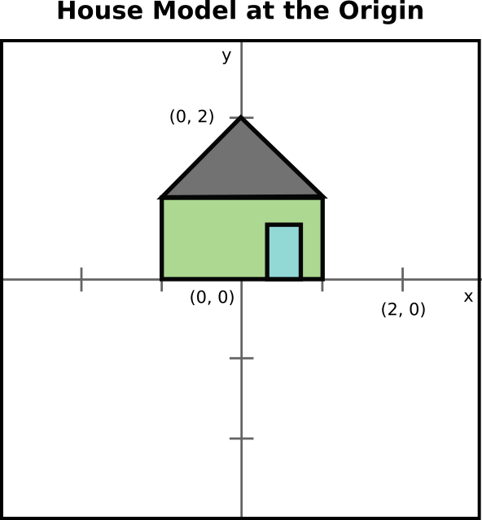
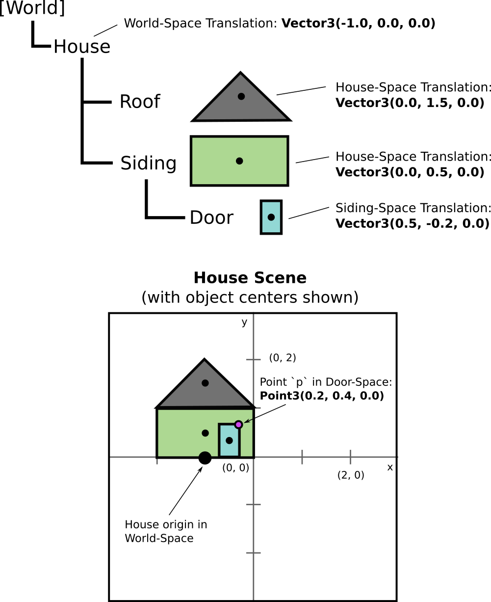

# Assignment 4 (Dance) Worksheet

## Q1: Transformations with Matrices

As you know from class, transformations are the foundation for so much of computer graphics.  This assignment deals with the important topic of composing transformations, so let's do some practice with that.  We'll use 3D transformation matrices and graphics code, but apply these to a simple house shape that lies in the XY-plane to make our drawings easier.  So, treat each vertex of the house like it is a 3D point, but where z=0.

Here's what the house looks like when viewed from some +Z height above and looking down at the origin.



### Q1.1 Basic translation

Here's a simple translation matrix.  Draw a picture of the house to show what it would look like if transformed by this matrix.
```
Matrix4 trans = Matrix4::Translation(Vector3(0.0, 0.5, 0.0));
```


### Q1.2 Basic scaling

Here's a simple scaling matrix.  Draw a picture to show what the original house would look like if transformed by this matrix.
```
Matrix4 scale = Matrix4::Scale(Vector3(2.0, 1.0, 1.0));
```


### Q1.3 Basic rotation

Here's a simple rotation matrix.  Draw a picture to show what the original house would look like if transformed by this matrix.
```
Matrix4 rot = Matrix4::RotateZ(GfxMath::toRadians(45.0));
```


### Q1.4 Composition 1

Now, let's take a look at different compositions of the basic matrices above.  Draw a picture to show what the original house would look like if transformed by the following matrix.
```
Matrix4 combo1 = trans * scale * rot;
```


### Q1.5 Composition 2

Let's try another.  Draw a picture to show what the original house would look like if transformed by the following matrix.
```
Matrix4 combo2 = rot * scale * trans;
```


--------------------------------------------------------------------------------


## Q2: Hierarchical Transformations

Now, similar to the animated characters in your assignment and the waving robot we programmed (or will be programming soon) in class, imagine that we wanted to represent the house as a hierarchy or *scene graph*, where each part is a separate geometric object that can be transformed relative to its parent.  This makes it easy to animate pieces of the house, perhaps making the door open and close, or to create many instances of the house and position them all at different locations within the scene.  There are many advantages to organizing graphics using a hierarchy of transforms.

All 3D graphics programs have a base coordinate system with an origin (0,0,0) and x,y,z axes.  By convention, we call this base coordinate system "World Space".  The (0,0,0) we have been referring to as "the origin" is more precisely called the "World Space Origin".  When we work with hierarchies of transformations it is useful to make this explicit because we will want to refer to other coordinate systems as well.  For example, while I would like to position my house relative to the world space origin.  I would like to position the roof of siding of the house relative to the "house space origin".  And, I would like to position the door relative to the "siding space origin".  It will be the same with animated characters.  I want to be able to define where the eyes go relative to the "head space origin", not relative to the pelvis or world space -- that would be much harder!

The diagram below illustrates this concept with the simple case of a house.  It's almost easier to describe when starting at the leaf nodes of the scenegraph, like the door in this case.  We want to position the door relative to the siding, so the door is defined in "siding space", i.e., the translation matrix applied to get the door in the right place is written as if (0,0,0) is at the center of the siding.  The siding, meanwhile, is positioned relative to the origin of the house, which is at the bottom center of the house.  The roof is also positioned relative to this "house space origin".  So, the house has 2 children (roof, siding), the roof has no children, and the siding has one child (the door).  The entire house is positioned relative to world space; here, just with a simple translation that can be thought of as moving the origin of the house coordinate system to some new position within the world.



It can be useful in these situations to define transformation matrices for moving from one coordinate space to another.  For example, given some point defined in the door's coordinate system, such as one of the vertices of the door, we could transform it into the siding's coordinate system like this:

```
// Transforms points in the door's coordinate system to the siding's coordinate system.
Matrix4 doorToSiding = Matrix4::Translation(Vector3(0.5, -0.2, 0.0));

// Imagine this is a vertex on the door
Point3 ptInDoorSpace = (....);
Point3 theSamePtExpressedInSidingSpace = doorToSiding * ptInDoorSpace;
```

Similarly, these matrices can convert between the other spaces we've talked about.
```
// Transforms points in the siding's coordinate system to the house's coordinate system.
Matrix4 sidingToHouse = Matrix4::Translation(Vector3(0.0, 0.5, 0.0));

// Transforms points in the house's coordinate system to the world's coordinate system.
Matrix4 houseToWorld = Matrix4::Translation(Vector3(-1.0, 0.0, 0.0));
```

### Q2.1 How would you compose the matrices above to create a single matrix that will transform a point in "door space" all the way into "world space"?


Given the matrices above matrices and the scene graph defined in the image, first
show the combined transformation from Door-Space into World-Space as a matrix
multiplication, then show how to transform the point `pInDoorSpace` into
World-Space. Lastly, show the numeric representation of `pInWorldSpace`.

```
// The magenta point `p` from the diagram, in Door-Space
Point3 pInDoorSpace = Point3(0.2, 0.4, 0.0);

// Combined transformation from Door-Space -> World-Space
Matrix4 doorSpaceToWorldSpace = Matrix4::Translation(-.5, .3, 0);

// The point `p` in world space
Point3 pInWorldSpace = doorSpaceToWorldSpace*pInDoorSpace
```

### Q2.2 Let's double-check your work now by calculate the actual "world space" coordinates for p.  Show what the following code would output:

```
std::cout << "p in World-Space: " << pInWorldSpace << std::endl;
p in World-Space: {-.3, .7, .0}
```
