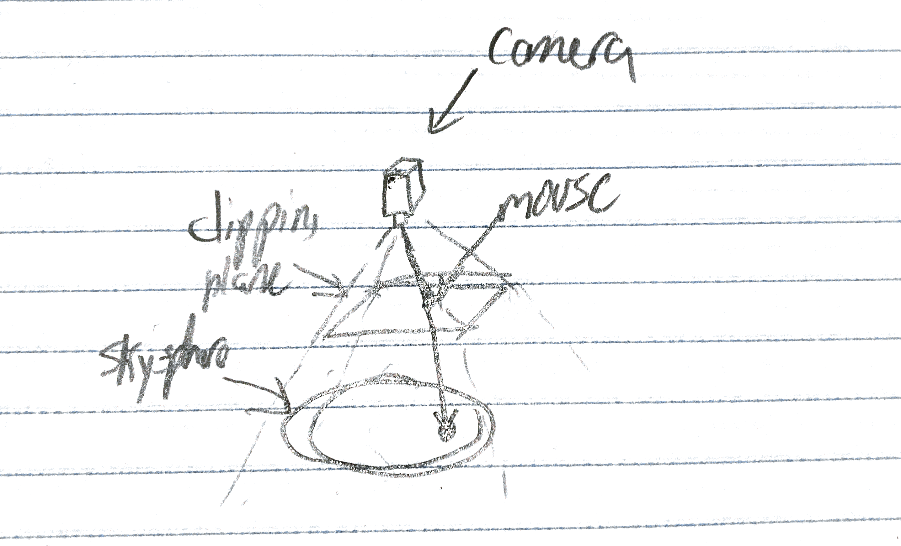

# Assignment 6 (Harold) Worksheet

For this assignment, one of the key parts is to check what part of the virtual
environment your mouse is currently touching - useful for determining what
type of stroke should be drawn when the mouse is clicked and dragged.


## Q1: Mouse-Sky Intersections (Part 1)

From the handout, we know that the sky here is really just a giant sphere
with a radius of 1500.0 units. In order to calculate where in the sky our
mouse is pointing in the scene, we need to perform a *ray-sphere
intersection* test. The ray starts at the eye location (camera position), and goes
through the current mouse location on the near clipping plane. This ray can be
traced to figure out where it intersects the sky sphere.

Create a top-down diagram of the scene including the sky sphere, the camera,
the mouse position, and the aforementioned ray from the eye through the mouse
position.

You can use the following images as inspiration for the shapes that you draw
in your diagram (replace this image with your final diagram):




## Q2: Mouse-Sky Intersections (Part 2)

Now, let's create the building blocks for the method `Sky::ScreenPtHitsSky()`,
which tests to see where the ray from the eye through the mouse intersects the
sky sphere! We're given the following information in this method:

- Camera view matrix (`Matrix4 view_matrix`)
- Camera projection matrix (`Matrix4 proj_matrix`)
- `Point2` normalized device coordinates of mouse (`Point2 normalized_screen_pt`)
    - Inclusive range [-1, 1]
    - `Point2(-1, 1)` is the upper left corner, and `Point2(1, -1)` is the
      lower right

1. The info above actually gives us all we need to calculate the camera's position (also known as the eye position) in world space, but it may not be obvious at first how to do this.  See if you can figure it out with a few hints below.
```
/* Hint 1: The view matrix transforms from one space to another, what are those spaces?
   Hint 2: It is possible to calculate the inverse of a transformation matrix, and Matrix4 has a handy routine for this.  As you would expect, the inverse of a transformation matrix will apply the opposite transformation.
 */
Point3 eye = view_matrix.Inverse()*proj_matrix.Inverse()*normalized_screen_pt
```

2. Construct the mouse pointer location in world space. We consider the mouse
   to be on the near clipping plane of the camera (this should sound familiar
   from your drawing in Q1!). In order to grab this point, MinGfx has a handy
   helper function called
   [`GfxMath::ScreenToNearPlane`](https://ivlab.github.io/MinGfx/html/html/classmingfx_1_1_gfx_math.html#a2086a2f885f887fb53da8a5adb5860f0).
   Use the MinGfx documentation at the link and the variables given above to
   construct the world-space representation of the mouse location:

```
Point3 mouseIn3d = Point3::ScreenToNearPlane(view_matrix, proj_matrix, normalized_screen_pt);
```

3. Create the ray from the eye through the world-space mouse location on the
   near plane. Use MinGfx's builtin `Ray` class for this.

```
Ray eyeThroughMouse = Ray(eye, mouseIn3d-eye);
```

4. Use the
   [`Ray::IntersectSphere()`](https://ivlab.github.io/MinGfx/html/html/classmingfx_1_1_ray.html#a970c7dbc19167be625967fabfb39b4ff)
   method to find the intersection point of the `eyeThroughMouse` ray and the
   sky sphere. This method contains one bit of C++ syntax that you may not
   have seen before - output parameters. The `Ray::IntersectSphere()` method
   sets both `iTime` and `iPoint` this way. Usually, best practice here is to
   declare a variable of the correct type before you call the method, then
   pass in a *reference* to this variable. For example:

```
// Declare output parameter `x`
float x;

// Call someFunction with output parameter
someFunction(&x);

// x now has the value set by someFunction
```

   Using the variables declared from the previous steps, write a code snippet
   that captures the return value of the sphere intersection test, as well as
   the `t` value and the `point` where the ray intersects the sphere.
   float* t;
   Point3* point;


```
// Declare output parameters

bool intersects = eyeThroughMouse.IntersectSphere(Point3(0,0,0), 1500.0, t, point);
```
